# AQuant - 智能量化交易分析与投研平台

AQuant 是一款基于现代 Web 技术栈构建的一站式量化交易分析与投研平台。平台融合了全市场实时行情监控、财务基本面离线计算、杜邦三因子拆解、行业估值聚合、公募基金持仓穿透与 QDII 额度监控、量化策略离线回测快照、智能自选预警及投研笔记管理，为投资者提供高效、深度、专业的数据分析与决策支持。

---

## 🚀 核心功能

### 1. 📈 大盘全景与市场博弈
- **核心大盘指数**：实时监控上证指数、深证成指、创业板指、科创50、北证50等核心指数，支持点击弹窗查看分时图与多周期 K 线趋势。
- **市场资金博弈看板**：实时追踪全市场资金流入流出动态、板块博弈格局与主力动向。

### 2. 📊 股票行情与板块监测
- **多周期行情分析**：支持全市场股票实时行情、分时明细及日/周/月/季/年多周期 K 线，内置专业均线系统（MA5/10/20/30/60/120/250）。
- **行业板块监测**：追踪申万行业与概念板块实时表现、资金流向，支持成分股下钻分析与板块历史趋势回溯。
- **股本与股息分析**：追踪上市公司总股本与流通股本变动历程；深度挖掘历史分红方案，计算股息率，辅助红利策略选股。

### 3. 🔬 财务基本面与本地离线计算引擎
- **资产负债表与业绩报表同步**：自动增量同步全市场上市公司季度资产负债表与业绩报表。
- **杜邦分析离线计算引擎 (DuPont Analysis)**：
  - 本地离线全量计算，彻底解耦外部接口调用；
  - 精准拆解杜邦三因子：**销售净利率**、**总资产周转率**、**权益乘数**；
  - 自动计算最新 3 年完整年报指标及 **3 年平均值**（`ROE 3年平均`、`净利率 3年平均`、`周转率 3年平均`、`权益乘数 3年平均`）；
  - 全行业 16 项关键指标的**行业均值**、**行业中位数**对比，以及行业内部 **ROE 3年平均同行业排名**。
- **估值模型与行业聚合 (Valuation Metrics)**：
  - 本地衍生计算 PE (TTM / 静态)、PB (MRQ / 静态)、PS (TTM / 静态)、PCF (TTM / 静态) 以及 **PEG**；
  - 聚合计算同行业估值中位数与行业平均水平，快速识别低估/高估标的。

### 4. 🏦 公募基金透视与 QDII 限购监控
- **基金基本资料与走势**：支持全市场公募基金筛选、最新净值与历史收益率走势分析。
- **十大重仓股穿透**：穿透分析基金底层资产配置，透视重仓个股权重分布。
- **QDII / 海外基金限购监控**：实时监控各大基金销售平台（如建设银行等）QDII 及海外基金的大额申购限额、暂停申购状态及限额变动预警。

### 5. ⚡ 量化策略与离线回测快照
- **双均线策略 (Dual MA)**：经典金叉/死叉量化模型，自动扫描全市场多空交易信号。
- **动量策略 (Momentum)**：基于价格走势强度与相对强弱指标进行标的优选，支持自定义回望周期。
- **MACD 策略**：基于 DIF 与 DEA 金叉、死叉识别趋势拐点，支持经典参数回测。
- **网格交易策略 (Grid Trading)**：按固定价格间距分层低买高卖，支持网格间距、层数和回测周期配置。
- **日级离线快照加速**：定时预计算预设参数组合的历史回测快照，列表查询毫秒级响应。
- **统计可靠度分析**：提供胜率、累计收益率、显著性检验（p值）与策略可靠度综合评分。

### 6. ⭐ 智能自选与价格预警通知
- **自选分组管理**：支持股票与基金灵活分组、置顶、自定义排序与跨模块联动筛选。
- **行情预警监控**：支持价格向上突破、向下跌破、均线交叉、MACD交叉和网格交易信号等预警规则，定时扫描行情并通过邮件等渠道自动推送提醒。

### 7. 📝 投研笔记与投资导航
- **富文本投研笔记 (Tiptap)**：支持 Markdown 语法、代码高亮、多级标题、图片插入与外链嵌入。
- **可见性控制**：支持文章公开/私密切换，公开笔记可在社区广场互动浏览。
- **投资导航 (Investment Navigation)**：精选整合权威财经门户、数据终端、官方交易所、研报库与量化分析工具入口。

### 8. ⏱️ 智能调度与同步水位控制
- **交易时段感知**：自动感知交易日历与交易时段，非交易时间降低轮询开销。
- **水位防重与增量同步 (`stock_sync`)**：各同步任务均配备独立同步水位时间戳，避免重复抓取被第三方限流。
- **数据清洗保障**：定时清洗退市/异常股票数据，分红数据保守去重，确保历史数据连续与精准。

---

## 🏗️ 系统架构


## 🎬 界面展示

### 大盘全景
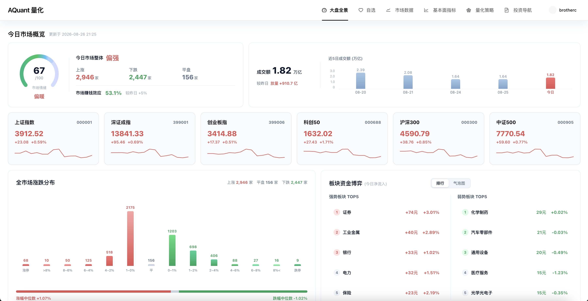

### 自选股票/基金
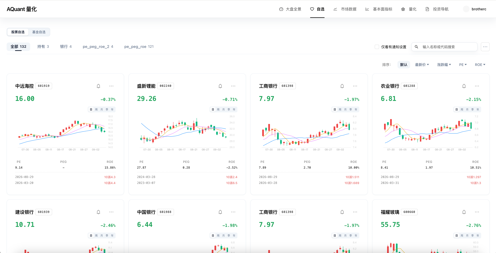
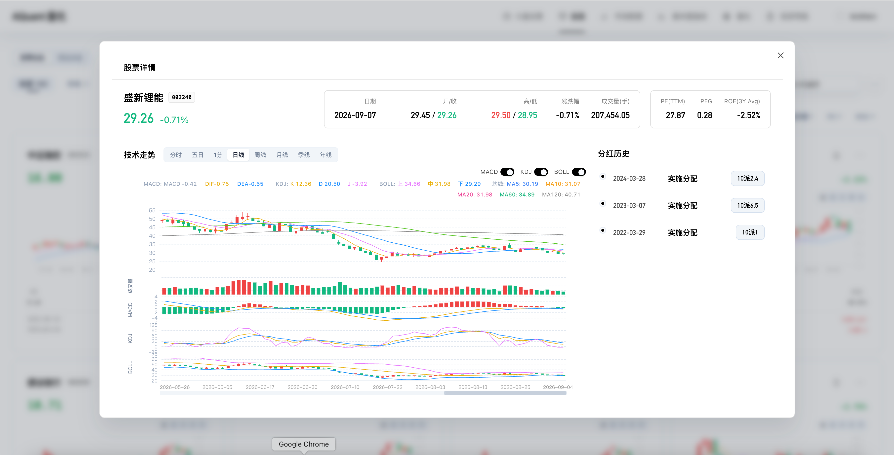
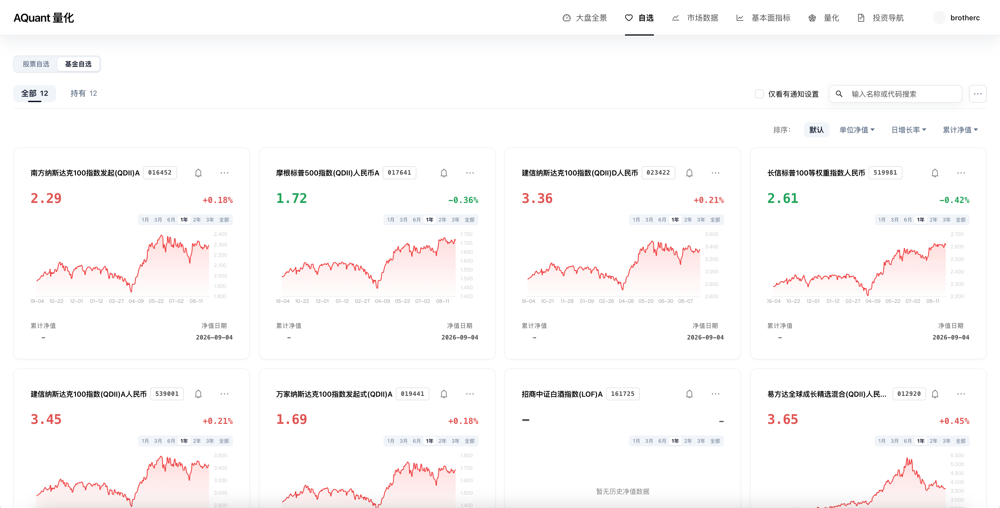
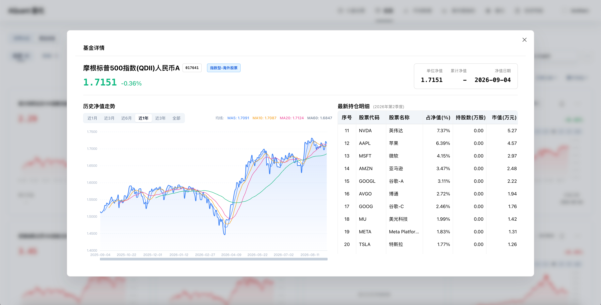


### 市场数据
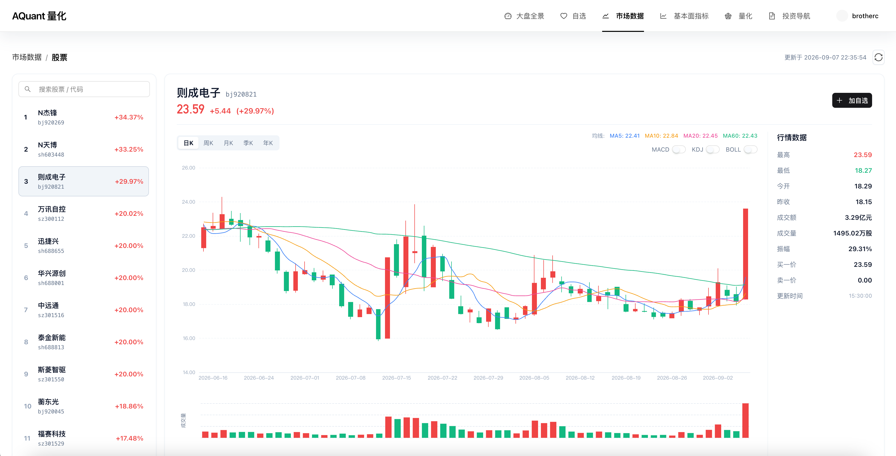  
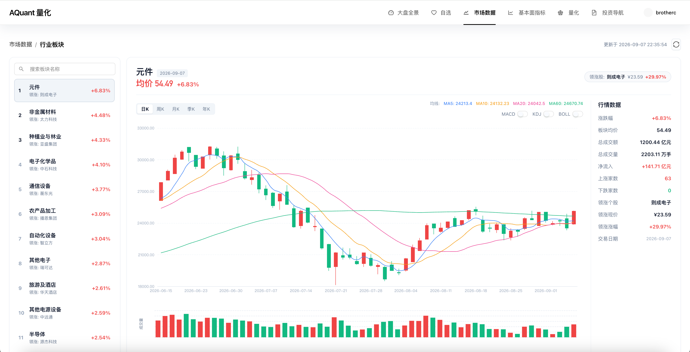  
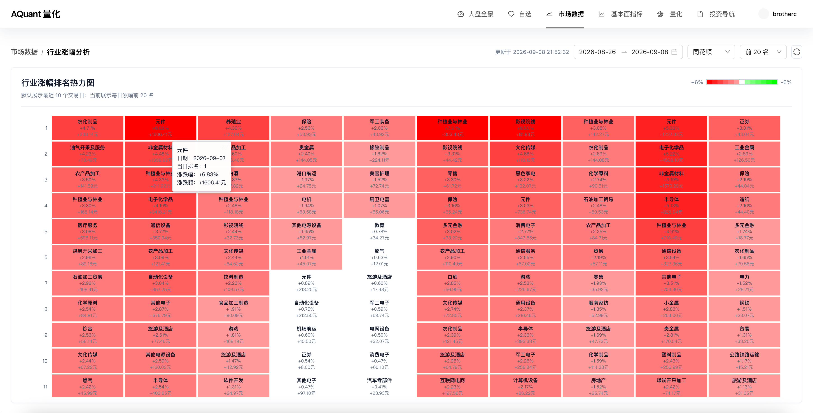  
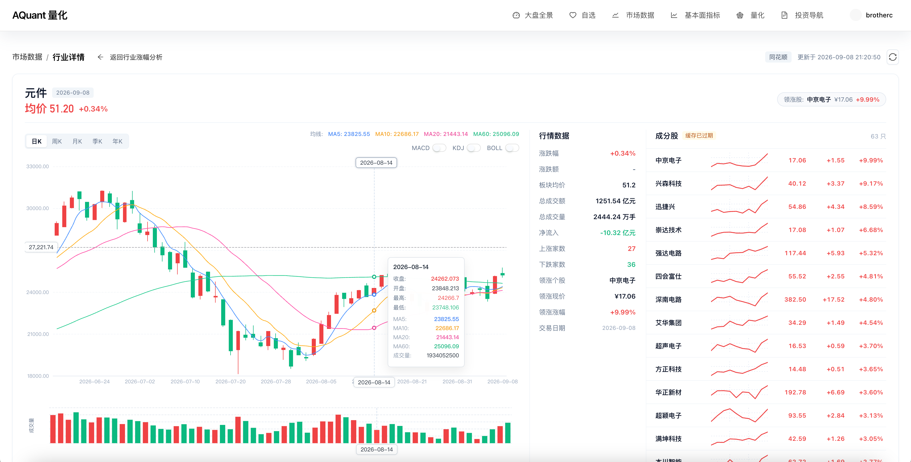  
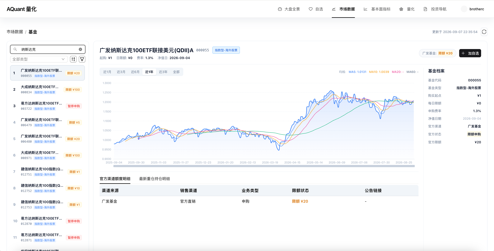  

### 基本面指标
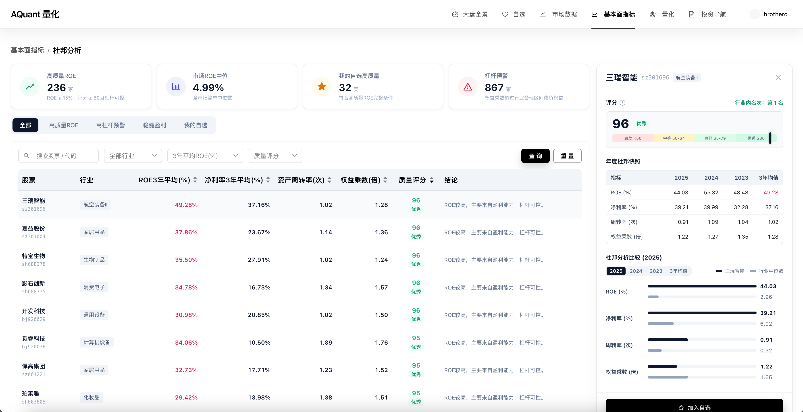  
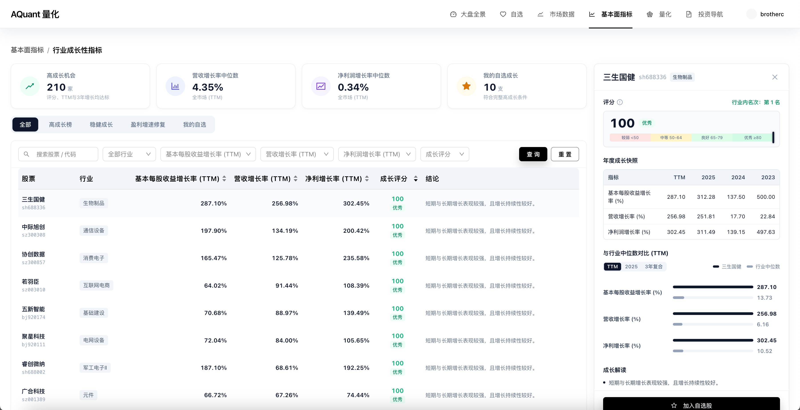  
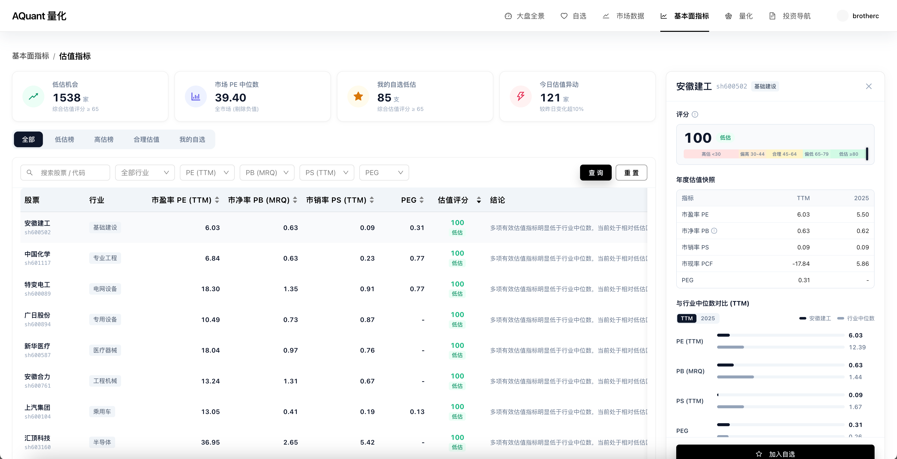  

### 分红数据
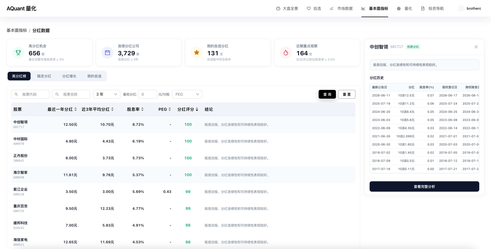

### 策略分析
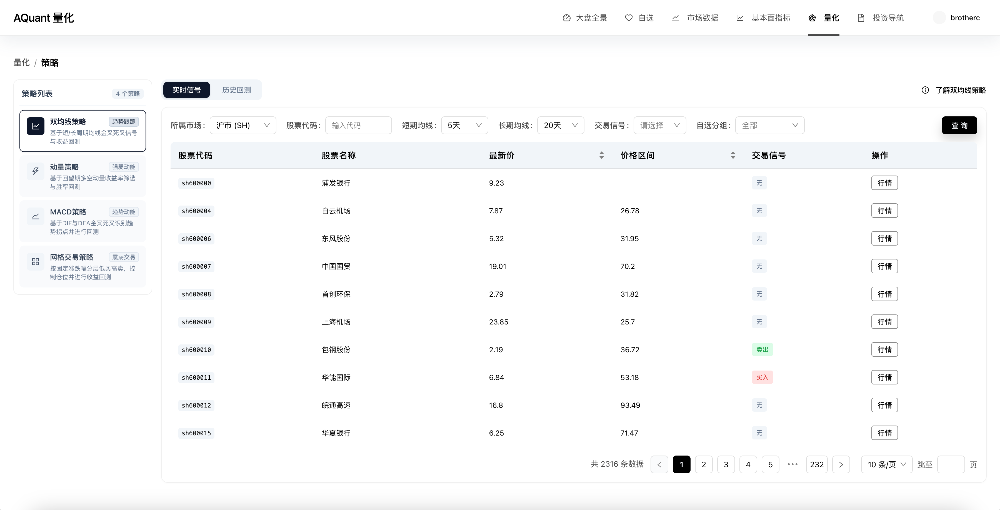
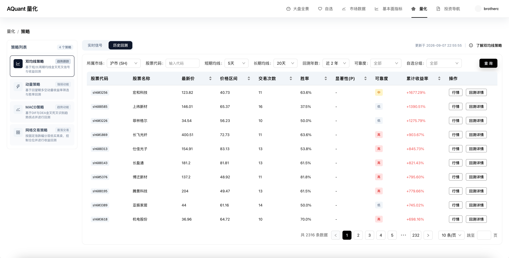
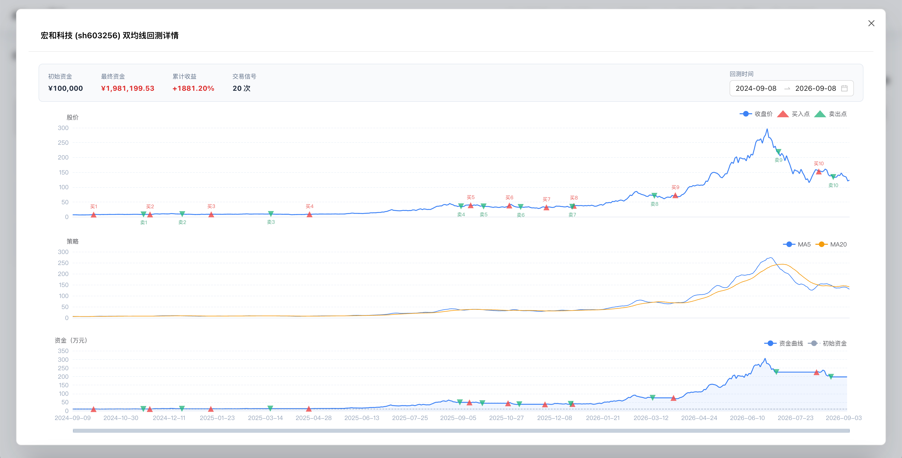

### 投资导航


---

## 🛠️ 技术栈

### 后端 (aquant-backend)
- **核心框架**: Spring Boot 3.x
- **持久层与 ORM**: Spring Data JPA, Hibernate
- **数据库**: MySQL 8.x / PostgreSQL
- **连接池**: Alibaba Druid
- **网络通信**: OkHttp 4.x, Gson, Jackson
- **认证与安全**: JWT (JSON Web Token), BCrypt 加密
- **高性能缓存**: Caffeine Cache
- **科学与统计计算**: Apache Commons Math 3.x
- **邮件预警服务**: Spring Boot Mail
- **接口文档**: Swagger / SpringDoc OpenAPI 3 (Knife4j)
- **开发工具**: Lombok

### 前端 (aquant-frontend)
- **核心框架**: Vue 3 (Composition API, `<script setup>`)
- **构建工具**: Vite 5.x
- **脚本语言**: TypeScript
- **UI 组件库**: Ant Design Vue 4.x
- **可视化图表**: ECharts 5.x
- **富文本编辑器**: Tiptap
- **状态管理**: Pinia
- **路由管理**: Vue Router 4.x
- **HTTP 客户端**: Axios

---

## 📦 快速开始

### 1. 克隆项目
```bash
git clone <repository-url>
cd AQuant
```

### 2. 数据服务端启动 (Python / AKTools)
本项目依赖 AkShare 获取基础金融数据，需先启动 `aktools` 作为本地数据服务：
```bash
# 确保 Python 3.9+ 环境
pip install aktools akshare
python3 -m aktools
```
- 服务默认运行在: `http://127.0.0.1:8080`

### 3. 后端服务启动 (Java / Spring Boot)
- 进入 `aquant-backend` 目录；
- 在 `src/main/resources/application.yaml` 中配置您的数据库连接与邮箱信息；
- 编译并运行后端：
```bash
cd aquant-backend
mvn clean install
mvn spring-boot:run
```
- 后端服务默认端口: `http://localhost:8084`
- API 交互文档访问: `http://localhost:8084/doc.html`

### 4. 前端服务启动 (Vue 3 / Vite)
- 进入 `aquant-frontend` 目录；
- 安装依赖并启动开发服务器：
```bash
cd aquant-frontend
npm install
npm run dev
```
- 前端访问地址: `http://localhost:5173`
- *注：Vite 已配置代理，会自动将 `/api` 请求反向代理至后端服务。*

---

## 📂 项目结构

```text
AQuant/
├── aquant-backend/          # Spring Boot 3 后端服务源码
│   ├── src/main/java        # 核心业务逻辑 (Controller / Service / Repository / Task)
│   └── src/main/resources   # 配置文件与 SQL 资源
├── aquant-frontend/         # Vue 3 前端源码
│   ├── src/api              # Axios 接口封装
│   ├── src/views            # 视图组件 (大盘全景/行情/财务指标/基金/策略/自选/文章等)
│   ├── src/layout           # 响应式布局组件
│   └── src/router           # 路由守卫与配置
├── screenshots/             # 系统各模块高清演示截图
└── README.md                # 项目文档
```

---

## 🤝 特别鸣谢

感谢以下优秀开源项目为本平台提供的数据与技术支持：
- [AkShare](https://github.com/akfamily/akshare) - 强大的开源金融数据接口库

---

## 📝 许可证

本项目采用 [MIT License](LICENSE) 授权。

---
*声明：本项目仅供量化投资研究与技术交流使用，不构成任何投资建议。量化有风险，入市需谨慎。*
